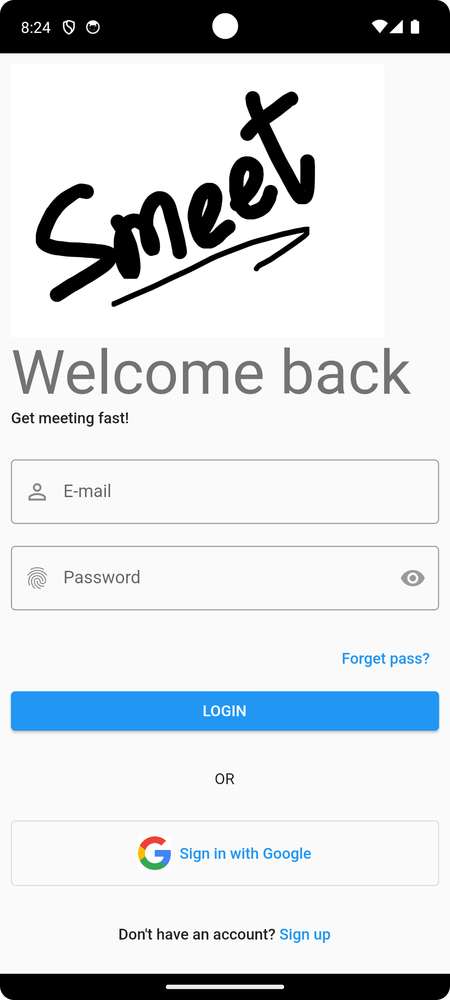
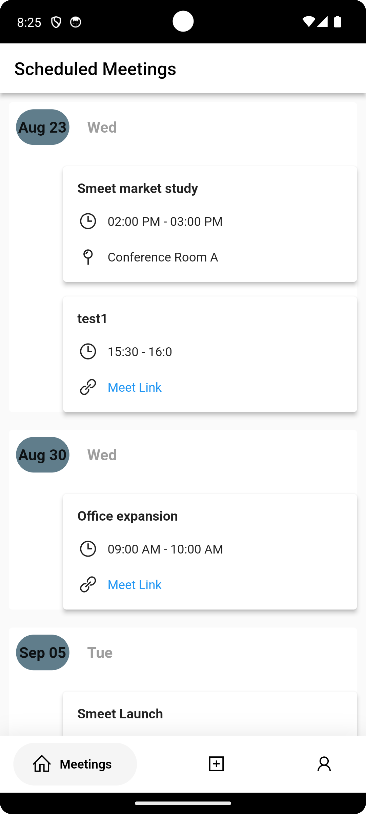
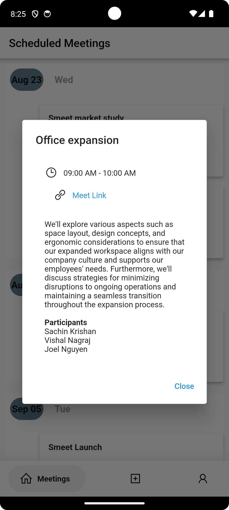
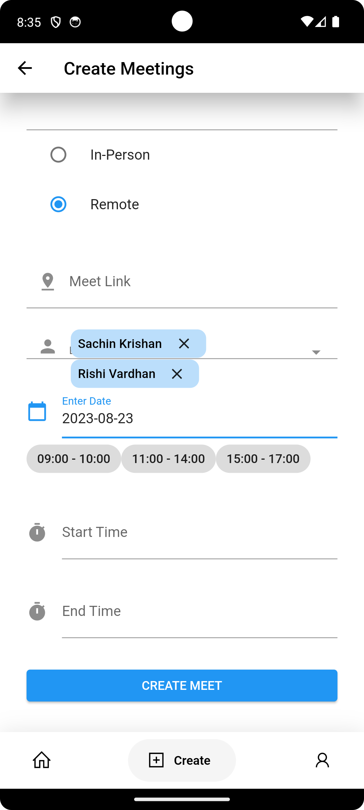

# **Welcome to Smeet - Your Ultimate Meeting Management App!**

Smeet is a powerful cross-platform mobile application built using Flutter, designed to revolutionize how you **schedule and track business meetings**. With a focus on efficiency and user-friendly features, Smeet aims to **enhance your meeting management experience**.

## **Key Features:**

- **Cross-Platform Excellence:** Smeet is developed with Flutter, ensuring a consistent and smooth experience across multiple platforms.

- **Robust Backend:** The app's backend is powered by Express.js, incorporating user authentication for security and seamless integration.

- **Effortless Meeting Organization:** Say goodbye to scheduling conflicts! Smeet employs a line sweep algorithm to **automate meeting organization**, considering the availability of multiple participants.

- **Intuitive Interface:** Designed with users in mind, Smeet boasts an **intuitive and user-friendly interface**. Managing meetings has never been easier or more enjoyable.

- **Data Management Made Simple:** Thanks to integration with MongoDB cloud database, Smeet effortlessly handles **data storage, retrieval, and management**.

## **Get Started:**

1. Clone the repository.
2. Connect MongoDB to your backend.
3. Launch Smeet and experience a new era of meeting management!

